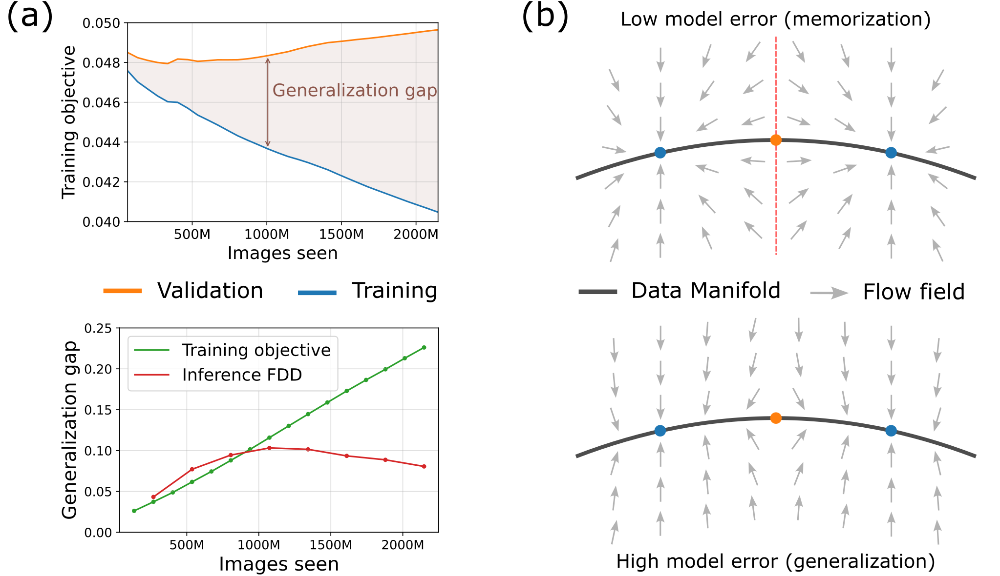

<div align="center">
<!-- TITLE -->

# Diffusion Models Memorize in Training -- and Generalize in Inference

[Tim Kaiser](https://www.linkedin.com/in/tim-kaiser-86a483265/) and [Prof. Dr. Markus Kollmann](https://www.mathmodeling.hhu.de/unser-team)

**[Mathematical modeling of biological systems lab (MMBS), Heinrich Heine University of Dusseldorf](https://github.com/HHU-MMBS/)**

  <!-- [](https://proceedings.bmvc2023.org/297/)  --> 
  
  [](https://arxiv.org/abs/2603.13419v2)  
 
</div>

<p align="center">
  <br>
  <em> <b>Qualitative summary of contributions.</b> (a) State-of-the-art diffusion models exhibit a growing generalization gap: the difference in reconstruction error (denoising training objective) between training and validation data increases as training progresses (top, green line bottom). This does not translate into overfitting on generated samples, as measured by the Fréchet-DINOv2-Distance (FDD, red line bottom). (b) Increasing model error smoothes the learned flow field, suppressing the generalization gap. For low model error (top), the flow field localizes sharply around training points, while for high model error (bottom), it more smoothly approaches the data manifold.</em>
</p>

## Abstract
Diffusion models generalize well in practice. 
However, an optimal diffusion model fully memorizes the training data and therefore fails to generalize, raising the question of what induces generalization in a real diffusion model.
We show that, despite generalizing at the sample level, diffusion models progressively overfit the denoising training objective and thereby create a generalization gap between the performance on validation and training samples. This gap is most pronounced at intermediate noise levels. 
Using a fully analytic error-prone toy model, we trace the factors affecting the generalization gap. We find that the optimal denoising flow field localizes sharply around training points, but the model error suppresses the exact recall of training points, yielding a smooth, generalizing flow field.
Finally, we find that the generalization gap observed in training does not translate to inference, which would result in a strong similarity between generated samples and training samples. This is because the intermediate states of sampling trajectories are sufficiently far from the distribution of noisy training samples the model is trained on.
Together, these findings reveal a novel picture of how diffusion models generalize: the flow field generalizes through model error, which moves sampling trajectories outside the domain of noisy training samples and thereby naturally prevents overfitting.


## Environment Setup & Installation

This project is tested and configured to run on **Python 3.9.19**. 

### Step-by-Step Installation
with **Miniconda**.

1. **Clone the Repository**
   ```bash
   git clone https://github.com/HHU-MMBS/diffusion_generalization_official
   cd diffusion_generalization_official
   ```

2. **Create and Activate the Conda Environment**
   Isolate your workspace by creating an environment strictly utilizing Python 3.9.19.
   ```bash
   conda create --name edm-env python=3.9.19 -y
   conda activate edm-env
   ```

3. **Install PyTorch with CUDA Support**
   Install the PyTorch runtime configured for your GPU's CUDA driver *prior* to handling the rest of the packages:
   ```bash
   conda install pytorch==2.5.1 torchvision==0.20.1 pytorch-cuda=12.1 -c pytorch -c nvidia -y
   ```

4. **Install Remaining Project Dependencies**
   Install the clean requirements profile mapped out for this project:
   ```bash
   pip install -r requirements.txt
   ```

## Reproduce Our Results
Note: If you have multiple GPUs, you can run all scripts with e.g. `torchrun --nrproc_per_node=4 script.py`.

### General preparation
1. Optionally download EDM and EDM2 model snapshots using `edm2/bash/download_edm2.sh` (otherwise they are downloaded on demand).
2. Prepare IN64/512 datasets according to the [EDM2](https://github.com/NVlabs/edm2) instructions and the CIFAR-10/100 
datasets according to the [EDM](https://github.com/nvlabs/edm) instructions.

### To reproduce results for reconstruction-based metrics:
1. In `edm2/generalization_gap_exps.py`:
   1. Specify the `proj_folder` for saving results on your machine.
   2. Specify `guidance_mode`, `dataset`, `model_type`, and `model_sizes`.
   3. Run the script.
2. This computes results for all reconstruction-based metrics and saves them in `{proj_folder}/data/rec_based/`.
3. Visualize results using `plots/reconstruction_based_plots.ipynb`.

### To reproduce results for trajectory-based metrics:
1. In `edm2/compute_frechet_metrics.py`:
   1. Specify the `proj_folder` for saving results on your machine.
   2. Setup your `wandb` settings in line 266.
   3. Specify your `dataset` and run the script with `model_sizes = []` to generate data subsets and labels.
2. For each model and snapshot you want to test, generate 50k samples using `edm2/bash/generate.sh` or `edm/bash/generate.sh`:
   1. Specify your `proj_folder` and, if you downloaded snaps, your `model_folder`.
   2. Make sure you set `metrics='none'` and specify the model and snaps you want to run.
3. Compute all metrics using `edm2/compute_frechet_metrics.py`. All results are logged with `wandb`.
4. Export results as `.csv` and save them in `proj_folder/data/fd_analysis/gen-v-train/` and `proj_folder/data/fd_analysis/gen-v-val/`, respectively.
5. Visualize results using `plots/trajectory_based_plots.ipynb`.

## Licence and information
We adapted the codebase of [EDM](https://github.com/nvlabs/edm) and [EDM2](https://github.com/NVlabs/edm2) for our
experiments, following their licence (`edm2/LICENCE.txt`), namely Attribution-NonCommercial-ShareAlike 4.0 International.

## Citation
```bibtex
@misc{kaiser2026diffusionmodelsmemorizetraining,
      title={Diffusion Models Memorize in Training -- and Generalize in Inference}, 
      author={Tim Kaiser and Markus Kollmann},
      journal={arXiv preprint arXiv:2603.13419},
      year={2026},
}
```
